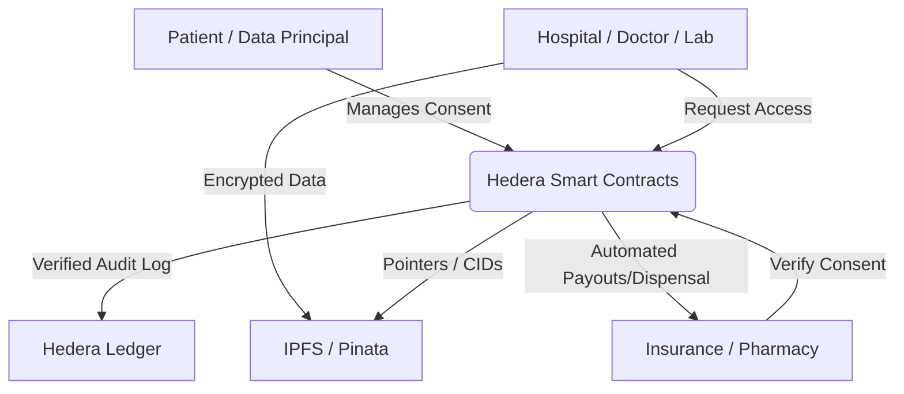

# 🏥 Hedera Healthcare Consent Network (Ojasraksha)


A state-of-the-art Decentralized Healthcare Data Governance platform built on **Hedera Hashgraph**. Engineered for absolute compliance with the **Digital Personal Data Protection (DPDP) Act 2023**, our platform empowers patients with full sovereignty over their medical records while ensuring seamless, secure interoperability across the healthcare ecosystem.

[](https://orochi-genshin11187.vercel.app)
[](https://portal.hedera.com/)
[](https://soliditylang.org/)
[](https://opensource.org/licenses/MIT)

---

## 🌟 Core Value Proposition

In traditional healthcare systems, patient data is siloed, and privacy is often secondary. **Ojasraksha** solves this with a trustless, transparent, and patient-centric architecture.

- **🛡️ Patient Sovereignty**: Patients "own" their digital identity and explicitly grant, modify, or revoke access to their data.
- **📜 Immutable Auditing**: Every single data interaction—from record creation to access—is logged on the Hedera ledger, providing a tamper-proof audit trail for regulatory oversight.
- **⚖️ DPDP Compliance**: Built-in mechanisms for **Notice & Consent (Section 5/6)**, **Right to Erasure (Section 12)**, and **Right to Nominate (Section 10)**.
- **🌐 Universal Interoperability**: A unified network linking Hospitals, Doctors, Labs, Pharmacies, and Insurers without a central point of failure.

---

## 🏗️ System Architecture

Ojasraksha uses a modular, layered architecture that separates data storage, decentralized logic, and user interaction.



### 🔐 Multi-Role Dashboard System

| Role | Responsibility | Core Features |
| :--- | :--- | :--- |
| **Patient** | Data Principal | Manage Records, Grant/Revoke Consent, Nominate Beneficiaries, Right to Erasure, Insurance Claims. |
| **Hospital** | Data Fiduciary | Upload Clinical Records, Request Access, Emergency "Break-Glass" Access. |
| **Doctor** | Data Fiduciary | View Authorized Medical History, Request Patient Data for Diagnosis. |
| **Lab** | Data Fiduciary | Upload Diagnostic Reports, Request Specialized Access. |
| **Pharmacy** | Data Fiduciary | View Authorized Prescriptions, Mark as Dispensed (Consent-locked). |
| **Insurance**| Data Fiduciary | Process Claims, Verify Clinical Evidence, Disburse Funds in HBAR. |
| **Admin** | Network Governance | Manage RBAC (Roles), Approve Fiduciaries. |
| **Auditor** | Compliance | Monitor global network logs for transparency and regulatory oversight. |

---

## 🔌 Technical Stack

- **Blockchain**: Hedera Hashgraph (Testnet) using **HSCS** (Hedera Smart Contract Service).
- **Smart Contracts**: Solidity ^0.8.20, managed via Hardhat.
- **Storage**: IPFS (InterPlanetary File System) via Pinata for decentralized medical record hosting.
- **Frontend**: React 19, Vite, Tailwind CSS, Three.js (for futuristic 3D visuals).
- **Backend**: Node.js & Express.js for insurance request processing and state management.
- **Encryption**: Client-side AES-256-GCM encryption before data leaves the browser.
- **Wallet Integration**: HashConnect / MetaMask for seamless Hedera interaction.

---

## 🚀 Key Features Walkthrough

### 1. DPDP Right to Erasure (Section 12)
Patients can trigger a "Universal Erasure Protocol." This revokes all active consents and sends formal on-chain requests to all clinical entities to purge their data, ensuring the "Right to be Forgotten."

### 2. Emergency "Break-Glass" Access
In critical scenarios where a patient is incapacitated, authorized hospitals can bypass standard consent. This action is **immediately logged as a Red Alert** on the blockchain and triggers instant notifications to beneficiaries.

### 3. Transparent Insurance Claims
Patients submit encrypted clinical record CIDs to insurers. The system distinguishes between "Processing" (authorized) and "Claimed" (funds disbursed via HBAR transfer), with every step recorded on-chain.

### 4. Beneficiary & Nomination
Patients can nominate up to 2 trusted individuals who can manage consents or access data on their behalf, ensuring continuity of care in all circumstances.

---

## 📂 Project Structure

```text
/
├── contracts/        # Solidity Smart Contracts (Hardhat)
├── frontend/         # React + Vite Frontend Application
├── server/           # Express.js Backend for Insurance Processing
├── scripts/          # Deployment & Utility Scripts
└── artifacts/        # Project Assets & Branding
```

---

## 🛠️ Installation & Setup

### Prerequisites
- Node.js (v18+)
- npm or yarn
- A Hedera Testnet Account ([Portal](https://portal.hedera.com/))
- Pinata API Keys (for IPFS storage)

### 1. Clone the repository
```bash
git clone https://github.com/your-username/hedera-healthcare-network.git
cd hedera-healthcare-network
```

### 2. Smart Contract Setup
```bash
# Install dependencies
npm install

# Compile contracts
npx hardhat compile

# Deploy to Hedera Testnet
npx hardhat run scripts/deploy.js --network hedera
```

### 3. Backend Setup
```bash
cd server
npm install
node index.js
```

### 4. Frontend Setup
```bash
cd ../frontend
npm install

# Create .env file
VITE_PINATA_API_KEY=your_key
VITE_PINATA_SECRET=your_secret
VITE_HEDERA_ACCOUNT_ID=your_id
VITE_HEDERA_PUBLIC_KEY=your_key

# Run development server
npm run dev
```

---

## 🛡️ Security & Privacy

We adhere to the principle of "Privacy by Design":
- **No Data on Chain**: Medical data is NEVER stored on the blockchain. Only encrypted IPFS CIDs are stored.
- **Zero-Knowledge Principle**: Data is encrypted using patient-controlled keys. Even the network admin cannot see medical records.
- **Role-Based Access Control (RBAC)**: Fine-grained permissions ensure that a Lab cannot see a Pharmacy's logs, and vice versa.

---

## 🤝 Contributing

We welcome contributions from the community! Please read our `CONTRIBUTING.md` for details on our code of conduct and the process for submitting pull requests.

## 📄 License

This project is licensed under the MIT License - see the [LICENSE](LICENSE) file for details.

---

*This project was developed for the Hedera Ecosystem to showcase the power of DLT in solving real-world privacy challenges in the healthcare sector.*
